```mermaid
erDiagram

  %% ═══════════════════════════════════════════════
  %% USERS
  %% ═══════════════════════════════════════════════

  CLIENT {
    ObjectId  _id           PK
    string    accountType   "person | company"
    string    firstName
    string    lastName
    string    companyName
    string    companySize   "1-10 | 11-50 | 51-200 | 201-500 | 500+"
    string    industry
    string    email         UK
    string    phone
    string    avatar
    string    bio
    string[]  achievements
    object    location      "city, region, country"
    boolean   isActive
    boolean   isVerified
    date      createdAt
  }

  AGENCY {
    ObjectId  _id              PK
    string    agencyName
    string    directorFirstName
    string    directorLastName
    string    businessNumber
    string    email            UK
    string    phone
    string    website
    string    logo
    string    bio
    string[]  specialties
    string    agencyType       "main | filiale"
    ObjectId  parentAgency     FK
    boolean   isActive
    boolean   isVerified
    date      createdAt
  }

  AGENCYMEMBER {
    ObjectId  _id               PK
    ObjectId  agency            FK
    string    firstName
    string    lastName
    string    email             UK
    string    jobTitle          "director | commercial | strategist | chef_de_projet | designer | editor | smm | community_manager"
    string[]  skills
    string    bio
    string    avatar
    string    accountStatus     "active | inactive | suspended | archived"
    boolean   mustChangePassword
    date      createdAt
  }

  TEAM {
    ObjectId  _id          PK
    string    teamName
    string    leadFirstName
    string    leadLastName
    string    email        UK
    string    phone
    string    website
    string    avatar
    string    bio
    string[]  specialties
    boolean   isActive
    boolean   isVerified
    date      createdAt
  }

  TEAMMEMBER {
    ObjectId  _id               PK
    ObjectId  team              FK
    string    firstName
    string    lastName
    string    email             UK
    string    jobTitle
    string[]  skills
    string    bio
    string    avatar
    boolean   isActive
    boolean   mustChangePassword
    date      createdAt
  }

  FREELANCER {
    ObjectId  _id                   PK
    string    firstName
    string    lastName
    string    email                 UK
    string    bio
    object    location              "city, region, country"
    string    carteAutoEntrepreneur
    string[]  skills
    string[]  categories
    object    socialLinks           "instagram, tiktok, youtube, linkedin, twitter"
    number    followersCount
    boolean   isActive
    boolean   isVerified
    date      createdAt
  }

  AGENCYCOLLABORATION {
    ObjectId  _id        PK "embedded in FREELANCER"
    ObjectId  agency     FK
    ObjectId  contractId FK
    string    role
    string    status     "active | ended"
    date      startDate
    date      endDate
    string    endReason
  }

  ADMIN {
    ObjectId  _id       PK
    string    firstName
    string    lastName
    string    email     UK
    boolean   isActive
    date      createdAt
  }

  %% ═══════════════════════════════════════════════
  %% POSTS & PITCHES
  %% ═══════════════════════════════════════════════

  POST {
    ObjectId  _id               PK
    ObjectId  client            FK
    string    title
    string    description
    string    objectives
    object    budget            "min, max, currency"
    date      deadline
    object    location          "city, region, country"
    string[]  categories
    string[]  requiredSkills
    string    marketingType     "Events | 360 Marketing | ATL | BTL | Production | Brand Marketing"
    string    collaborationType "service | partnership | sponsorship | exposure"
    string    compensationType  "monetary | benefits | mixed"
    string    benefits
    string[]  targetProviders   "agency | team | freelancer | all"
    string    status            "open | in_progress | closed | reactivated"
    boolean   isPublic
    object    initiatedBy       "initiatorType, initiatorId"
    date      createdAt
  }

  PITCH {
    ObjectId  _id            PK
    string    pitchType       "agency_to_client | team_to_client | freelancer_to_client | agency_to_freelancer"
    ObjectId  post            FK
    ObjectId  client          FK
    ObjectId  senderAgency    FK
    ObjectId  senderTeam      FK
    ObjectId  senderFreelancer FK
    string    senderType      "Agency | Team | Freelancer"
    object    strategy        "strategyOverview, creativeIdea, objectives, techniques"
    object    content         "contentPillars, publicationCalendar, postingFrequency"
    object    analysis        "competitiveAnalysis, colorPalette, positioningStrategy"
    object    targetAudience  "ageMin, ageMax, gender, niche, locations"
    string    description
    object    proposedPrice   "amount, currency"
    object    timeline        "duration, unit, startDate, endDate"
    string    contractType    "cdd | cdi"
    string    status          "pending | accepted | rejected | withdrawn"
    string    internalStatus  "draft | with_chef_de_projet | approved | sent"
    ObjectId  createdBy       FK
    date      respondedAt
    string    rejectionReason
    date      createdAt
  }

  %% ═══════════════════════════════════════════════
  %% PROJECTS & TASKS
  %% ═══════════════════════════════════════════════

  PROJECT {
    ObjectId  _id              PK
    ObjectId  post             FK
    ObjectId  pitch            FK
    ObjectId  client           FK
    ObjectId  providerAgency   FK
    ObjectId  providerTeam     FK
    ObjectId  providerFreelancer FK
    string    providerType     "Agency | Team | Freelancer"
    string    title
    string    description
    date      startDate
    date      deadline
    date      completedAt
    number    progress         "0–100"
    string    projectStatus    "pending | active | in_review | completed | cancelled"
    object    agreedPrice      "amount, currency"
    string    contractType     "cdd | cdi | project"
    ObjectId  conversationId   FK
    date      createdAt
  }

  TASK {
    ObjectId  _id              PK "embedded array in PROJECT"
    string    title
    string    description
    object[]  assignedTo       "memberType, memberId, memberName"
    string    status           "todo | in_progress | in_review | done"
    string    priority         "low | medium | high | urgent"
    date      dueDate
    date      startDate
    object[]  deliverables     "fileUrl, fileName, submittedBy, note"
    object[]  comments         "authorId, authorName, text"
    object[]  previousAssignees "memberId, memberName, removedAt"
    date      createdAt
  }

  %% ═══════════════════════════════════════════════
  %% CONTRACTS
  %% ═══════════════════════════════════════════════

  CONTRACT {
    ObjectId  _id                  PK
    ObjectId  project              FK
    ObjectId  pitch                FK
    string    contractType         "service_agreement | collaboration | cdd | cdi | project"
    string    partyAType           "Agency | Team | Freelancer"
    ObjectId  partyAId             FK
    string    partyAName
    string    partyBType           "Client | Freelancer | AgencyMember"
    ObjectId  partyBId             FK
    string    partyBName
    string    title
    string    objet
    string    prestations
    string    livrables
    object    financialTerms       "amount, currency, paymentMethod, paymentSchedule"
    object    duration             "startDate, endDate, notes"
    boolean   confidentialityClause
    boolean   exclusivityClause
    string    resiliationTerms
    string    status               "draft | sent | acknowledged | signed | resiliation"
    object    contractPdf          "fileId, filename, url, generatedAt"
    object    receipt              "fileId, filename, url, uploadedAt"
    object    bonDeCommande        "fileId, filename, url, sentAt"
    date      createdAt
  }

  %% ═══════════════════════════════════════════════
  %% CHAT
  %% ═══════════════════════════════════════════════

  CONVERSATION {
    ObjectId  _id          PK
    ObjectId  project      FK "unique — one conversation per project"
    object[]  participants "participantType, participantId"
    date      createdAt
  }

  MESSAGE {
    ObjectId  _id          PK
    ObjectId  conversation FK
    ObjectId  sender       FK "polymorphic"
    string    senderRole   "client | agency | agency_member | freelancer | team | team_member"
    string    senderName
    string    senderType   "Client | Agency | AgencyMember | Freelancer | Team"
    string    messageType  "text | file | contract_pdf | receipt | bon_de_commande | system"
    string    content
    object    file         "fileId, filename, url, mimeType, size"
    boolean   isRead
    date      readAt
    object    metadata     "contractId"
    date      createdAt
  }

  %% ═══════════════════════════════════════════════
  %% COLLABORATION & SOCIAL
  %% ═══════════════════════════════════════════════

  COLLABORATIONREQUEST {
    ObjectId  _id          PK
    string    fromType     "Freelancer | Agency"
    ObjectId  fromId       FK
    string    fromName
    string    toType       "Agency | Team | Client"
    ObjectId  toId         FK
    string    toName
    string    message
    string    proposedRole
    string    status       "pending | accepted | declined | withdrawn"
    date      respondedAt
    string    declineReason
    date      createdAt
  }

  PROFILEPOST {
    ObjectId  _id         PK
    ObjectId  author      FK "polymorphic: agency | team | freelancer | client"
    string    authorRole  "agency | team | freelancer | client"
    string    authorName
    string    content
    object[]  media       "fileId, url, type"
    string    postType    "update | achievement | campaign | announcement"
    ObjectId[] likes
    date      createdAt
  }

  PERSONALNOTE {
    ObjectId  _id          PK
    ObjectId  owner        FK "polymorphic: any authenticated user"
    string    ownerRole
    string    text
    boolean   isPinned
    boolean   isReminder
    date      reminderDate
    boolean   isDone
    date      createdAt
  }

  %% ═══════════════════════════════════════════════
  %% NOTIFICATIONS & AUDIT
  %% ═══════════════════════════════════════════════

  NOTIFICATION {
    ObjectId  _id            PK
    ObjectId  recipient      FK "polymorphic — any role"
    string    recipientRole  "client | agency | agency_member | team | team_member | freelancer"
    string    recipientModel "Client | Agency | AgencyMember | Team | TeamMember | Freelancer"
    string    type           "pitch_received | pitch_accepted | project_created | contract_sent | task_overdue | collaboration_request | system | ..."
    string    category       "tasks | projects | contracts | pitches | deadlines | admin | messages"
    string    title
    string    body
    string    link
    boolean   isRead
    object    metadata       "postId, pitchId, projectId, senderId, senderName"
    date      createdAt
  }

  ACTIVITYLOG {
    ObjectId  _id         PK
    ObjectId  actorId     FK "polymorphic"
    string    actorRole
    string    actorName
    string    actionType  "user_registered | post_created | pitch_sent | pitch_accepted | project_created | contract_signed | ad_created | member_created | account_restored | ..."
    ObjectId  targetId    FK "polymorphic"
    string    targetType  "Post | Pitch | Project | Contract | ..."
    string    description
    date      createdAt
  }

  %% ═══════════════════════════════════════════════
  %% SYSTEM / ADMIN
  %% ═══════════════════════════════════════════════

  AD {
    ObjectId  _id         PK
    string    title
    string    imageUrl
    ObjectId  imageFileId
    string    linkUrl
    string[]  targetRoles "client | agency | agency_member | team | team_member | freelancer | all"
    string    placement   "sidebar | banner | card"
    boolean   isActive
    date      startDate
    date      endDate
    ObjectId  createdBy   FK
    date      createdAt
  }

  OPTIONSLIST {
    ObjectId  _id     PK
    string    key     UK "specialties | regions | categories"
    string    label
    string[]  values
    date      createdAt
  }

  %% ═══════════════════════════════════════════════
  %% RELATIONSHIPS
  %% ═══════════════════════════════════════════════

  %% ── User hierarchy ──
  AGENCY              ||--|{  AGENCYMEMBER        : "employs"
  AGENCY              |o--o|  AGENCY              : "parentAgency (filiale of)"
  TEAM                ||--|{  TEAMMEMBER          : "has member"
  FREELANCER          ||--o{  AGENCYCOLLABORATION : "has collaboration"
  AGENCYCOLLABORATION }o--||  AGENCY              : "with agency"
  AGENCYCOLLABORATION }o--o|  CONTRACT            : "governed by"

  %% ── Saved posts (many-to-many) ──
  AGENCY              }o--o{  POST                : "savedPosts"
  TEAM                }o--o{  POST                : "savedPosts"
  FREELANCER          }o--o{  POST                : "savedPosts"

  %% ── Flagged posts (agency internal) ──
  AGENCY              }o--o{  POST                : "flaggedPosts"
  AGENCYMEMBER        }o--o{  POST                : "flags for director"

  %% ── Post lifecycle ──
  CLIENT              ||--o{  POST                : "creates"
  POST                ||--o{  PITCH               : "receives"
  POST                ||--o{  PROJECT             : "spawns"

  %% ── Pitch senders ──
  AGENCY              }o--o{  PITCH               : "sends"
  TEAM                }o--o{  PITCH               : "sends"
  FREELANCER          }o--o{  PITCH               : "sends"
  AGENCYMEMBER        |o--o{  PITCH               : "createdBy (internal)"
  PITCH               }o--||  CLIENT              : "targets client"

  %% ── Project creation ──
  PITCH               ||--o|  PROJECT             : "triggers creation"
  PROJECT             ||--o{  TASK                : "contains (embedded)"

  %% ── Project parties ──
  CLIENT              ||--o{  PROJECT             : "is client on"
  AGENCY              |o--o{  PROJECT             : "providerAgency"
  TEAM                |o--o{  PROJECT             : "providerTeam"
  FREELANCER          |o--o{  PROJECT             : "providerFreelancer"

  %% ── Member assignment ──
  AGENCYMEMBER        }o--o{  PROJECT             : "assignedProjects"
  TEAMMEMBER          }o--o{  PROJECT             : "assignedProjects"

  %% ── Contracts ──
  PROJECT             ||--o{  CONTRACT            : "has"
  PITCH               |o--o|  CONTRACT            : "source pitch"

  %% ── Chat ──
  PROJECT             ||--o|  CONVERSATION        : "has (1 per project)"
  CONVERSATION        ||--o{  MESSAGE             : "contains"

  %% ── CollaborationRequest ──
  FREELANCER          |o--o{  COLLABORATIONREQUEST : "sends (fromFreelancer)"
  AGENCY              |o--o{  COLLABORATIONREQUEST : "sends (fromAgency)"
  AGENCY              |o--o{  COLLABORATIONREQUEST : "receives"
  TEAM                |o--o{  COLLABORATIONREQUEST : "receives"

  %% ── Notifications (polymorphic recipient — shown for key roles) ──
  CLIENT              ||--o{  NOTIFICATION        : "receives"
  AGENCY              ||--o{  NOTIFICATION        : "receives"
  AGENCYMEMBER        ||--o{  NOTIFICATION        : "receives"
  TEAM                ||--o{  NOTIFICATION        : "receives"
  TEAMMEMBER          ||--o{  NOTIFICATION        : "receives"
  FREELANCER          ||--o{  NOTIFICATION        : "receives"

  %% ── Personal notes (polymorphic owner) ──
  CLIENT              ||--o{  PERSONALNOTE        : "owns"
  AGENCYMEMBER        ||--o{  PERSONALNOTE        : "owns"
  TEAMMEMBER          ||--o{  PERSONALNOTE        : "owns"
  FREELANCER          ||--o{  PERSONALNOTE        : "owns"

  %% ── Profile posts (polymorphic author) ──
  CLIENT              ||--o{  PROFILEPOST         : "publishes"
  AGENCY              ||--o{  PROFILEPOST         : "publishes"
  TEAM                ||--o{  PROFILEPOST         : "publishes"
  FREELANCER          ||--o{  PROFILEPOST         : "publishes"

  %% ── Admin creates ads ──
  ADMIN               ||--o{  AD                  : "creates"
  ADMIN               ||--o{  ACTIVITYLOG         : "actions logged"
```

# Marketili — Database Schema (ER Diagram)

> 20 collections · MongoDB / Mongoose · Generated 2026-05-17

---



---

## Collection Summary

| Collection | Purpose | Key Refs |
|---|---|---|
| **Client** | Platform buyer — creates posts, reviews pitches | Post[] |
| **Agency** | Marketing agency — pitches on posts, manages members | AgencyMember[], Pitch[], Post[] (saved/flagged) |
| **AgencyMember** | Staff of an agency — director / commercial / strategist / chef_de_projet / ... | Agency, Project[], Task[] |
| **Team** | Smaller provider team | TeamMember[], Pitch[], Post[] |
| **TeamMember** | Staff of a team | Team, Project[], Task[] |
| **Freelancer** | Independent provider — pitches directly & joins agencies | Pitch[], agencyCollaborations[], clientProjects[] |
| **Admin** | Platform administrator — full access | — |
| **Post** | Client marketing need — open for pitches | Client, Pitch[], Project[], sentTo[], savedBy[] |
| **Pitch** | Provider bid on a post — 4 pitch types | Post, Client, Agency/Team/Freelancer, Project |
| **Project** | Shared project — created from accepted pitch | Post, Pitch, Client, Provider, Contract[], Task[], Conversation |
| **Task** | Work item — **embedded array** inside Project | Project (parent), assignedTo[] |
| **Contract** | Legal agreement between two parties | Project, Pitch, partyA (provider), partyB (client/freelancer) |
| **Conversation** | One chat thread per project | Project (unique), Message[] |
| **Message** | Single chat message — text, file, or system event | Conversation, sender (polymorphic) |
| **CollaborationRequest** | Freelancer/Agency application to join Agency/Team | fromId (polymorphic), toId (polymorphic) |
| **Notification** | Event notification for any user | recipient (polymorphic), metadata (postId, pitchId, projectId) |
| **ProfilePost** | Public social post on a profile | author (polymorphic) |
| **PersonalNote** | Private note/reminder for a user | owner (polymorphic) |
| **ActivityLog** | Admin audit trail — 14 action types | actorId (polymorphic), targetId (polymorphic) |
| **Ad** | Platform advertisement — role/placement targeted | Admin (createdBy) |
| **OptionsList** | Admin-managed dropdown values (specialties, regions, categories) | — |

---

## Status Flows

```
POST:     open → in_progress → closed → reactivated
PITCH:    pending → accepted | rejected | withdrawn
          (internal) draft → with_chef_de_projet → approved → sent
PROJECT:  pending → active → in_review → completed | cancelled
TASK:     todo → in_progress → in_review → done
CONTRACT: draft → sent → acknowledged → signed | resiliation
COLLAB_REQUEST: pending → accepted | declined | withdrawn
FREELANCER collaboration: active → ended
AGENCYMEMBER account: active → inactive | suspended | archived
```

---

## Key Design Decisions

| Decision | Rationale |
|---|---|
| **Tasks embedded in Project** | Tasks are always fetched with their project — no join needed, and atomicity is maintained |
| **Polymorphic refs (recipient, owner, author)** | Avoids 6 separate notification collections; queried by `recipientModel` + `recipientId` |
| **One Conversation per Project** | Contract PDF exchange, receipt, and general messages all share one thread tied to the project |
| **Denormalized name fields** (partyAName, senderName, authorName) | Avoids populate on high-frequency read paths; names rarely change |
| **agencyCollaborations embedded in Freelancer** | A freelancer's context switches are always loaded together with their profile |
| **Soft deletes only** | `isActive`, `accountStatus`, and status enums — nothing is ever hard-deleted |
| **Separate collections per role** | Allows role-specific fields, indexes, and validation without discriminators |
